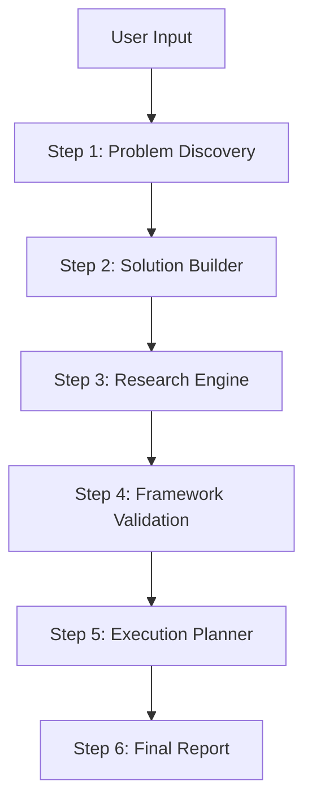

# SolutionForge — AI Solution Builder & Framework-Based Validator

A brutalist-terminal themed monorepo platform designed to turn raw problem statements into fully validated, production-ready execution plans. Built using **FastAPI** (Python 3.11+) and **Next.js 16** (App Router, Turbopack, Tailwind v4).

---

## Architecture Overview

SolutionForge is organized as a dual-service monorepo:
1. **`backend/`**: A FastAPI REST server that coordinates schema-driven structured LLM generations utilizing the Google GenAI SDK (`google-genai`). It features a pipeline that parses inputs, queries Gemini, validates models, and compiles ReportLab-generated PDF files.
2. **`frontend/`**: A Next.js client that exposes a high-fidelity workspace. State is indexed in `localStorage` to support resuming step progress offline.

---

## Technical Pipeline & Operations

The workspace coordinates a 6-step sequential pipeline:



### 1. Step 1: Problem Discovery
* **Endpoint**: `POST /api/discovery`
* **Backend Processing**: Takes the initial problem, constraints, and goals. Refines the problem statement, extracts key business assumptions with associated risk levels (High/Medium/Low), maps out target stakeholders, and defines structured success metrics.
* **Output Model**: `DiscoveryResult`

### 2. Step 2: Solution Builder
* **Endpoint**: `POST /api/solution`
* **Backend Processing**: Accepts the `DiscoveryResult` state. Generates three distinct solution architectures, matches each with Pros & Cons, details MVP core feature lists, and structures suggested feature backlogs with Value and Complexity metrics.
* **Output Model**: `SolutionResult`

### 3. Step 3: Research Engine
* **Endpoint**: `POST /api/research`
* **Backend Processing**: Grounded search and structural validation against market realities. Performs competitor landscape analysis, builds pricing benchmarks (Tiers, Models, Cost Ranges), details cost estimates, and matches requirements with recommended vendor resources.
* **Output Model**: `ResearchResult`

### 4. Step 4: Framework Validation
* **Endpoint**: `POST /api/validate`
* **Backend Processing**: Processes upstream data through five industry-standard business validation frameworks:
  * **Lean Canvas**: 9-block validation grid.
  * **SWOT Analysis**: Internal/External evaluation matrix.
  * **Porter's Five Forces**: Compiles industry competitive pressures.
  * **Jobs To Be Done (JTBD)**: Maps user jobs, pains, and gains.
  * **Value Proposition Canvas**: Compares Customer Profile needs against product Value Map features, outputting a detailed fit analysis.
  * **Strategic Recommendations**: Custom evaluations identifying validation gaps and recommended actions.
* **Output Model**: `ValidationResult`

### 5. Step 5: Execution Planner
* **Endpoint**: `POST /api/execution`
* **Backend Processing**: Formulates a phase-by-phase operational launch plan (30, 60, and 90 days), maps out budget breakdowns across categories, identifies critical implementation risks with alternative backup mitigations, and lists quantitative KPIs with target goals.
* **Output Model**: `ExecutionResult`

### 6. Step 6: Final Report
* **Endpoint**: `POST /api/report`
* **Backend Processing**: Combines all stages into a unified report package. Generates a Markdown brief with tabular structures and writes a clean Executive Summary.
* **Output Model**: `ReportResult`
* **Export PDF Endpoint**: `POST /api/export/pdf` — Takes raw report structures and builds a clean PDF stream using ReportLab.

---

## Design System & UX Principles

The frontend layout employs a custom brutalist-terminal style defined in `globals.css`:
* **Typography**: Optical-variable serif `Fraunces` for hero display headings; `DM Mono` for all tabular listings, controls, code previews, and metadata labels.
* **Colors**: High-contrast, single-accent color scheme:
  * Background: Deep charcoal `#0C0C0C` layered with a CSS-only dot-grid pattern.
  * Accents: Acid chartreuse (`#CAFF00`) for active tabs, highlight tags, and glowing border animations.
* **State & Performance**: Offline-first indexing via browser storage (`project_data_{id}`). Page load contains staggered `animation-delay` entry reveals.

---

## Development & Deployment

### Local Development

#### 1. Backend Server
```bash
cd backend
python3 -m venv .venv
source .venv/bin/activate
pip install -r requirements.txt
# Populate .env with GEMINI_API_KEY
uvicorn app.main:app --port 8000 --host 0.0.0.0 --reload
```

#### 2. Frontend Server
```bash
cd frontend
npm install
npm run dev
```

### Automated Testing
To run backend unit tests:
```bash
cd backend
pytest
```
